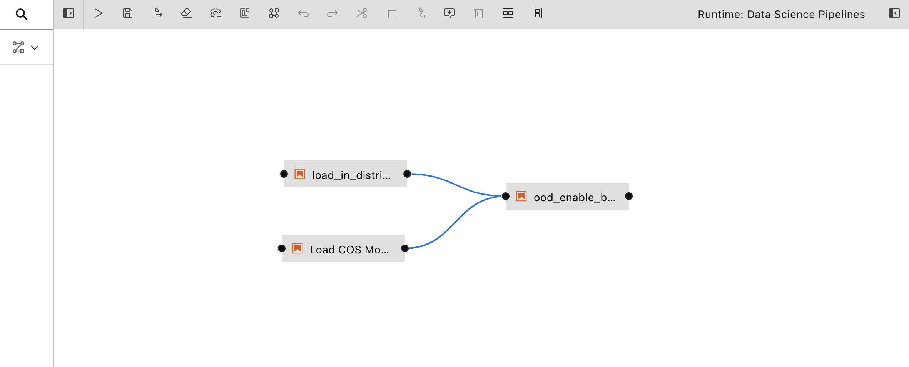
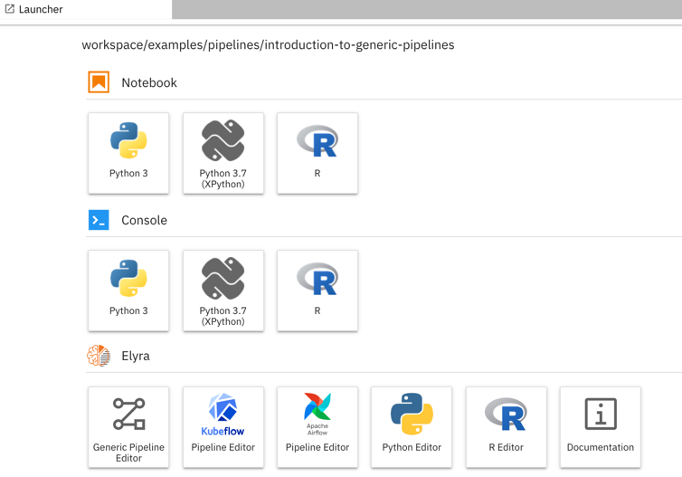
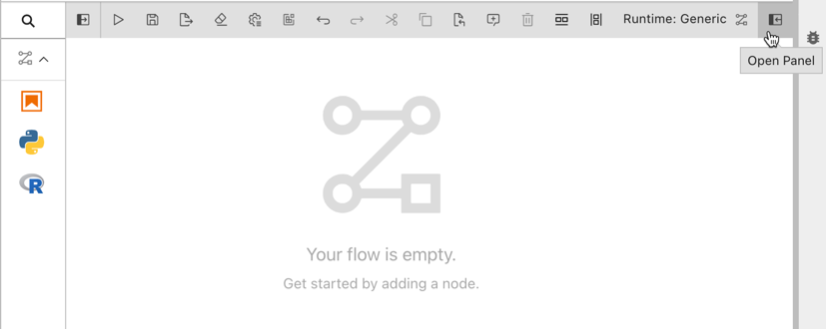
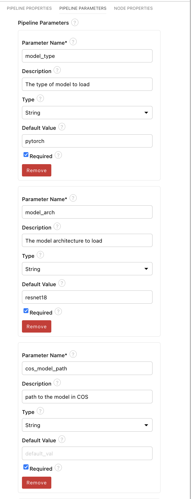
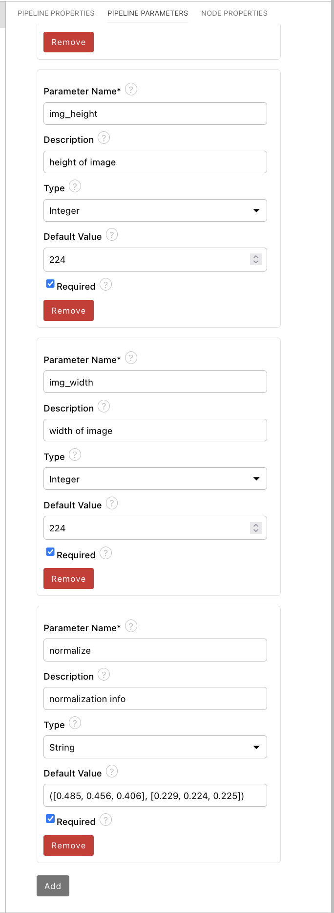
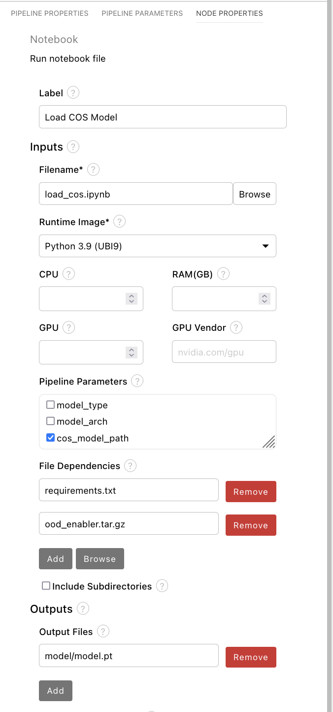
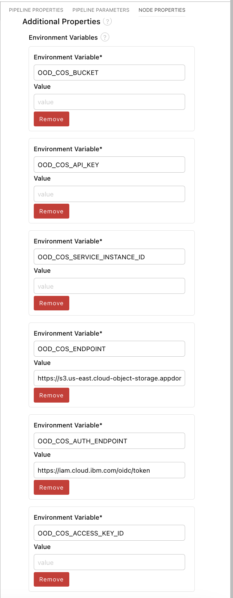
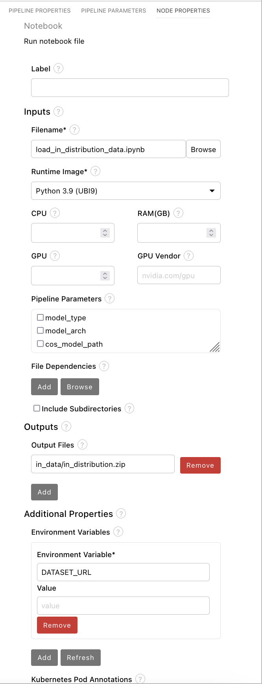
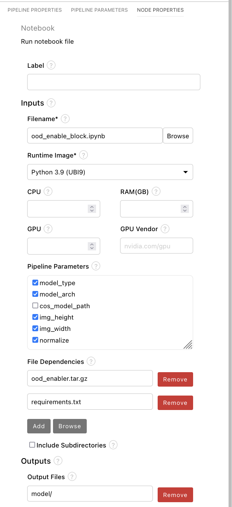
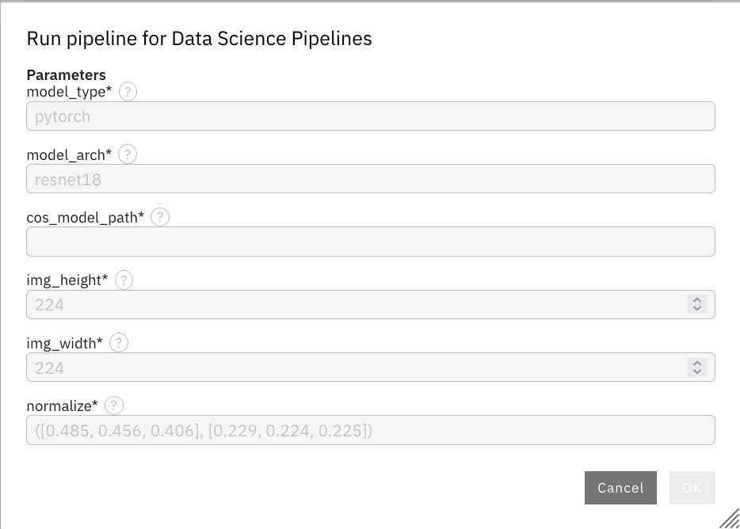

# Getting started with Out-of-Distribution (OOD) enablement for pipelines

This repo contains notebooks that can be used as blocks in Data Science Pipelines (DSP) for creating an OOD-enablement of vision model workflows.  

## Tutorial
This tutorial will walkthrough how to set up the blocks in DSP using the Elyra visualization tool to create an OOD-enablement workflow, as well as how to deploy the model to retrieve the OOD, or model certainty, scores.  
 


### Setup
In addition to this repo, the tutorial requires the [trustyai-ood](https://github.com/trustyai-explainability/trustyai-ood) library to perform the OOD enablement functions, as well as support for connecting to COS for gathering models or data.

1. Launch JupyterLab.    
   > **Note**: When you start JupyterLab using the `jupyter lab` command, it loads the contents of the current working directory.  
   > For example, we recommend starting JupyterLab from a new directory on your system that is not an existing git repository. This will make sure you can clone the repository as mentioned in the next step.
1. Open the _Git clone_ wizard (Git > Clone A Repository).
1. Enter `https://github.com/trustyai-explainability/trustyai-pipeline-blocks.git` as _Clone URI_.
1. In the _File Browser_ navigate to `/trustyai-pipeline-blocks/out_of_distribution/`.
1. Inside this directory, once again open the Git clone wizard and enter `https://github.com/trustyai-explainability/trustyai-ood.git` as Clone URI to add the OOD enablement library to the project*

*NOTE: Due to a bug in the Elyra tool, in order to pass this repo into the specific blocks requiring it as a dependency, it must first be compressed into a _.tar.gz_ file, so upon cloning into the project, convert to a .tar.gz file using the python console or notebook available in DSP.

You are now ready to follow the steps in this tutorial.

### Create a generic pipeline
1. Open the _Launcher_ (File > New Launcher) if it is not already open.
   

1. Open the _Generic Pipeline Editor_ to create a new untitled generic pipeline.

1. In the Visual Pipeline Editor open the properties panel on the right side.

   

1. Select the _Pipeline parameters_ tab and create the following parameters necessary to create the OOD enablement flow. Note default values are not required but shown here for completion.



1. From the _JupyterLab File Browser_ drag the following notebooks into the Visual Pipeline Editor
  - load_cos.ipynb - loads a model from Cloud Object Storage
  - load_in_distribution_data.ipynb - loads an in-distribution dataset from a public URL
  - ood_enable_block.ipynb - OOD enables a pre-trained model

  <!-- end of the list -->

  <br>Now connect the `loal_cos.ipynb` and `load_in_distribution_data.ipynb` to the `ood_enable.ipynb` block as seen in the following image:
  
1. Click on the `load_cos.ipynb` notebook block and open the properties panel on the right side of the visual editor, and navigate to the _node properties_ pane to enter details such as the following.
 <br><br>There are several things to note:
  - For `Pipeline Parameters` this notebook utilizes the cos_model_path parameters
  - Under `File Dependencies` this notebook expects the `requirements.txt` file found in the repo, and the compressed ood_enabler repo
  - Under `Outputs`, the notebook creates a `model/` directory and the last cell renames the downloaded file `model.pt`. In order to change the name - especially if using a different machine learning framework, then change the name of the last cell, and copy it here for the output file.

  <!-- end of the list -->
  <br>If you scroll down further, you will see environment variables that are referenced in the notebook that are required to be filled out. As seen below: 
  <br><br>Note: If `OOD_COS_ACCESS_KEY_ID` and `OOD_COS_SECRET_ACCESS_KEY` are used - which correspond to S3 credentials - then the other ODD_COS environment variables corresponding to IBM COS (other than bucket) don't have to be used. Likewise, you don't have to enter the S3 credentials if the IBM COS values are used.
1. Now click on the `load_in_distribution_data.ipynb`notebook block and open the properties panel on the right side of the visual editor, and navigate to the _node properties_ pane.
  <br><br> There are several things to note:
  - Under `Outputs` the notebook creates a directory named _in_data_ and saves the downloaded dataset as _in_distribution.zip_
  - Under `Environment Variables`, only one is used, which is `DATASET_URL`. The value should be the public URL to download the dataset.
  <br><br>NOTE: If the data set you would like to use is also stored on COS, you can copy the _load_cos.ipynb_ notebook and change the outputs to correspond to the data set being downloaded. Here, we wanted to show different ways for collecting assets for the pipeline.<br><br>
1. Finally, click on the `ood_enable_block.ipynb` notebook block and open the properties panel on the right side of the visual editor, and navigate to the _node properties_ pane.
<br><br>There are several things to note:
  - All of the pipeline parameters are used with the exception of the `cos_model_path`.
  - Under `File Dependencies` this notebook expects the `requirements.txt` file found in the repo, and the compressed ood_enabler repo
  - Under `Outputs` the notebook saves the _model_ directory to the COS specified in ODH environment. <br><br>
1. With all the notebook block parameters complete, save the pipeline and then run it - this will cause an input box to appear to enter pipeline parameter values:

<br><br>After running, you'll receive a link to monitor the progress of the workflow, as well as the location in COS where the outputs will be stored, which you can use to deploy the model using the _model serving_ service once complete.

<br> After deploying, you can submit an inference requests to the model as usual, but after OOD enablement, there will be an additional output, as shown below:
```
headers = {'content-type': 'application/json'}

r = requests.post(MODEL_ENDPOINT, json=payload, headers=headers)

r.text

'{"model_name":"rhods-demo-model","model_version":"1","outputs":[{"name":"logits","datatype":"FP32","shape":[5,2],"data":[0.18706955,-0.64808923,0.40501827,-0.62095106,0.33623296,-0.48156342,0.02713162,-0.2124287,0.08002673,-0.49602267]},
{"name":"ood_scores","datatype":"FP32","shape":[5,1],"data":[0.64985806,0.84450656,0.8332145,0.7213891,0.6245305]}]}'
```
